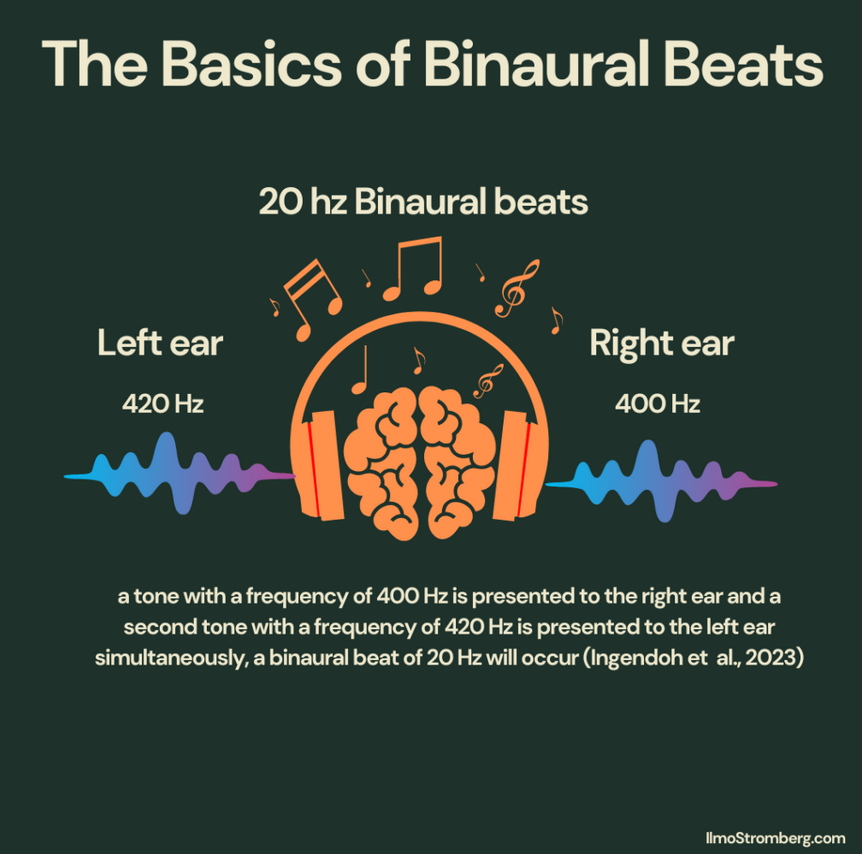
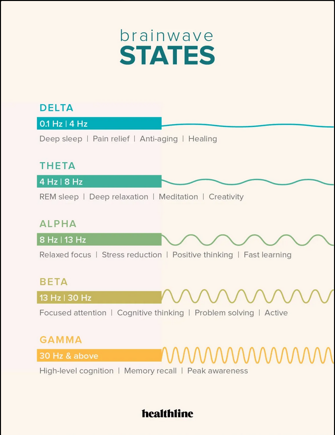

# Usage:
1. `Requirements: pip3 install numpy scipy sounddevice`
2. `RUN:        python3 binauralbeats.py`

# What are BinauralBeats ?
Binaural beats are an auditory illusion created when two tones of slightly different frequencies are played separately to each ear. The brain processes these two frequencies and perceives a **third tone — a rhythmic "beat"** whose frequency is the difference between the two original frequencies.
- 

For example, if one ear hears a 420 Hz tone and the other hears 400 Hz, the brain perceives a 20 Hz binaural beat. This beat is not an external sound but a result of neural activity mainly in the brainstem's superior olivary complex, which integrates sound from both ears.

# Why two seperate frequency to simulate, and not directly generate the third final tone ?
The key difference is that binaural beats are a **perceived auditory illusion created inside the brain** by presenting slightly different frequencies to each ear separately. The brain processes these two tones and generates a third "beat" tone internally. This internal perception engages neural processing in a unique way that direct mono tones or external beats do not.

# Why are BinauralBeats?
Listening to binaural beats can cause the brain's electrical activity to synchronize (entrain) to the beat frequency, potentially influencing mental states. Different binaural beat frequencies correspond to brain wave patterns linked with various states of consciousness:
- Delta (<4 Hz): deep sleep
- Theta (4–8 Hz): meditation, drowsiness
- Alpha (8–13 Hz): relaxation, creativity
- Beta (13–30 Hz): alertness, concentration
- Gamma (30–50 Hz): high-level cognition and memory
- 

# Scientific opinion on BinauralBeats.
Although the exact mechanisms and benefits are still being researched, binaural beats may modulate mood, attention, and cognitive performance via this frequency-following response in brain waves.
- [National Library of Medicine on BinauralBeats](https://pmc.ncbi.nlm.nih.gov/articles/PMC10198548/)
- [sleepfoundation.org - BinauralBeats for sleeping aid](https://www.sleepfoundation.org/noise-and-sleep/binaural-beats)
- [What are Binaural Beats - WebMD](https://www.webmd.com/balance/what-are-binaural-beats)
